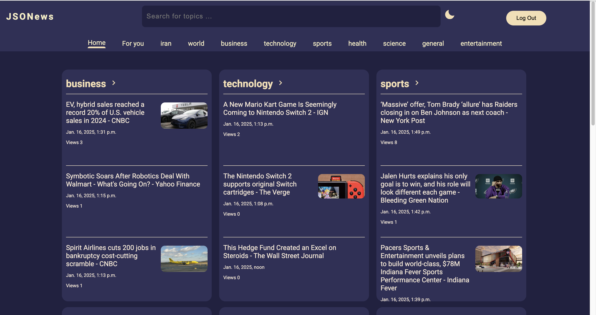

# JSONews - News Web Application

A dynamic news aggregation web application built with Django that provides categorized news content from various sources. The application features real-time updates, user customization, and a clean, responsive interface.

## Features

- **Categorized News**: Browse news articles across multiple categories:
  - Business
  - Technology
  - Sports
  - Health
  - Science
  - General
  - Entertainment

- **Regional Coverage**:
  - Iran news
  - World news

- **User Features**:
  - User authentication (login/signup)
  - Personalized "For You" feed based on user preferences
  - Customizable topic selection
  - View count tracking for articles

- **Search Functionality**:
  - Elasticsearch integration for efficient news search
  - Search across titles and descriptions
  - Fuzzy matching support

- **UI/UX**:
  - Dark/Light theme toggle
  - Automatic RTL/LTR text direction detection
  - Responsive design
  - Real-time news updates (every 3 seconds)

## Technology Stack

- **Backend**:
  - Django
  - Python
  - Elasticsearch
  - NewsAPI integration

- **Frontend**:
  - HTML5
  - CSS3
  - JavaScript
  - BoxIcons

- **Database**:
  - Django ORM
  - Elasticsearch for search functionality

## Installation

1. Clone the repository
2. Create and activate a virtual environment
3. Install dependencies: `pip install -r requirements.txt`
4. Add your NewsAPI key:   NEWS_API_KEY=your_api_key_here
5. Run migrations: `python manage.py migrate`
6. Start the development server: `python manage.py runserver`

## Usage

1. Access the admin panel at `/admin` to manage news updates and content
2. Create a superuser to access the admin panel: `python manage.py createsuperuser`
3. Use the "update news from api" action in the admin panel to fetch fresh news

## Acknowledgments

- [NewsAPI](https://newsapi.org/) for providing the news data
- [BoxIcons](https://boxicons.com/) for the icon set
